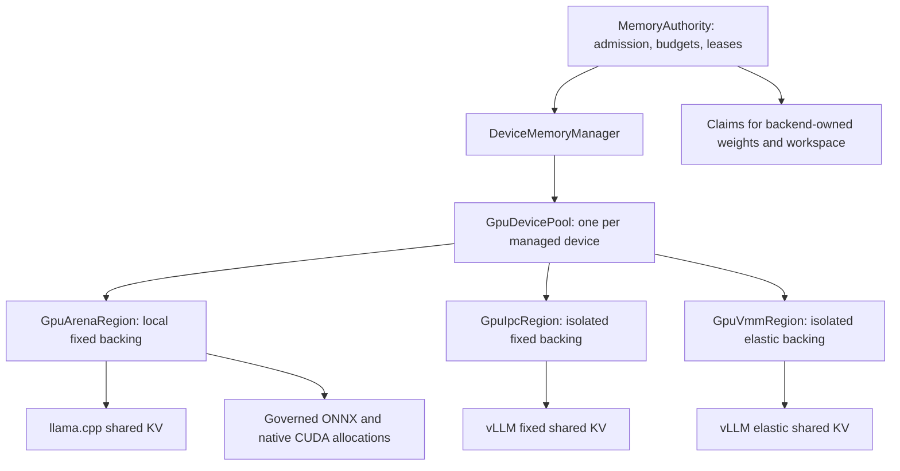

# One GPU allocation model, multiple backing regions

Status: incremental implementation. This branch prepares one `GpuDevicePool` per
managed CUDA device, owning HAL 0.3.2 arena, IPC and VMM regions. Region selection,
local allocation leases and exported-region adapters use this common interface.
Existing arena callbacks and llama.cpp's single-base KV view remain compatibility
paths. The SDK release is awaiting its required GitHub review; engine lockfile
resolution and verification against the published package remain pending.
Automatic multi-arena capacity policy and hardware qualification are still pending. The scope is Kapsl-managed CUDA memory.

## The model

Kapsl should expose one `GpuDevicePool` per device **within a runtime**, with several
backing regions behind it. A region owns a particular CUDA allocation or virtual
address reservation. The pool selects compatible regions and tracks allocations;
the existing `MemoryAuthority` remains responsible for admission and device budgets.

“One pool” means a consistent allocation and ownership model. It does not require
all backends to use one CUDA allocation, one base address, or one KV block layout.



There may be several regions of each kind. The fixed and elastic vLLM paths are
alternative configurations; a deployment need not instantiate both. Tensor-parallel
workers can require regions on multiple devices, coordinated by the runtime.

Backend-owned memory stays visible to the budget even when Kapsl does not allocate
it. The diagram does not imply that all llama.cpp, ONNX, or vLLM memory already
passes through Kapsl's allocator.

## From the current code to the proposed names

| Current implementation | Proposed role | Target name |
| --- | --- | --- |
| HAL `GpuDevicePool`, owning one CUDA slab | A fixed local region with a range allocator | `GpuArenaRegion` |
| Runtime `GpuIpcPoolAllocation` | Dedicated exportable fixed backing | `GpuIpcRegion` |
| Runtime `GpuVmmPoolAllocation` and its segments | A stable virtual range with adjustable physical backing | `GpuVmmRegion` |
| Per-device pool ownership in `DeviceMemoryManager` | Ownership of the common region registry and allocation interface | Generalized `GpuDevicePool` |
| `GpuSharedPoolProvisioner` | Translate KV contracts into region requests and worker descriptors | Keep as a runtime adapter |

This is an end-state naming scheme. Changing the public HAL `GpuDevicePool`
immediately would break callers that expect a single base pointer and storage
view. Introduce the registry through the runtime first, then migrate the SDK API
with an explicit compatibility layer and dependency release.

The common physical implementation belongs in `kapsl-sdk/crates/kapsl-hal`.
`kapsl-engine` should retain admission policy, model ownership, participant
registration, KV geometry, and distributed resize coordination. The HAL must not
depend on `MemoryAuthority` or the KV control protocol.

Suggested eventual HAL layout:

```text
kapsl-hal/src/memory/
    gpu_pool.rs             # registry, handles, compatible-region selection
    gpu_region.rs           # region capabilities and physical lifecycle
    gpu_arena_region.rs     # local fixed backing and suballocation
    gpu_ipc_region.rs       # dedicated CUDA IPC backing
    gpu_vmm_region.rs       # virtual reservation and physical segments
```

## What an allocation means

Three concepts need distinct names and lifetimes:

| Concept | Meaning | Example |
| --- | --- | --- |
| Budget grant | Permission to commit additional physical capacity | Admit another 2 GiB of KV backing |
| Region lease | A right to use compatible backing for a workload or participant | A vLLM worker's exported KV region |
| Allocation lease | A byte extent within a region | An ONNX tensor or a llama.cpp KV block |

A region can serve many local allocation leases. An exported region can instead
be leased to a backend that manages its own blocks. vLLM should keep its native
block allocator; it does not need an RPC to Kapsl for every token or KV block.

Allocation handles should identify the device, pool, region, allocation, owner,
and generation. Their fields should be private. Release validates the handle
against the live registry so a stale handle cannot free a newer allocation that
reused the same offset. The backend receives the pointer or descriptor appropriate
to its adapter, rather than constructing allocation handles itself.

A pointer is meaningful in the importing process's CUDA context. Exported regions
need stable addresses within each worker where required; workers need not receive
identical numeric addresses.

A lease ending does not prove GPU completion. Local release must retain the extent
until the allocator's completion contract is satisfied; cross-stream use needs
the appropriate dependency tracking or fencing. Reassigning an extent to another
owner must also complete any required clearing before the new owner can use it.

## Request properties, not backend-specific allocation branches

Region selection should follow the properties requested by an adapter:

- Device, owner, allocation class, size, and alignment.
- Local access or export to an authorized participant.
- Isolation domain: which allocations may share backing visible to that participant.
- Address and contiguity requirements.
- Fixed capacity, or initial and maximum capacity with explicit resize support.

For example:

| Consumer | Request | Usual region |
| --- | --- | --- |
| Governed ONNX CUDA allocator | Local byte allocations, alignment, workload quota | Local arena |
| llama.cpp shared KV | Local blocks, stable base, adapter-defined block geometry | Local arena pinned for that KV view |
| vLLM fixed shared KV | Exportable backing isolated to the participant, fixed capacity | Dedicated IPC region |
| vLLM elastic shared KV | Exportable backing, stable virtual range, staged capacity changes | Dedicated VMM region |

Isolation is a backing-allocation property. Exporting a handle to an arena that
also contains another workload's data does not become isolated merely because
the descriptor names a smaller byte range. A shared arena must never be selected
for an export whose isolation requirements it cannot satisfy.

The request model also makes future integrations possible without adding another
unrelated allocator. A backend that cannot satisfy a region's lifecycle protocol
must use another supported mode or fail admission explicitly.

## An illustrative interface

This sketch describes the runtime-facing contract, not compilable Rust. Admission
and resize coordination wrap lower-level HAL region operations.

```rust
struct RegionRequest {
    owner: WorkloadId,
    class: AllocationClass,
    isolation: IsolationDomain,
    access: AccessMode,          // local or participant export
    capacity: CapacityRequest,   // fixed, or initial + maximum
    alignment: usize,
    address: AddressRequirements,
}

// Admission/setup path: may allocate backing or perform CUDA mapping work.
let region = memory.acquire_region(device, request)?;

// Local use: allocate within already available compatible backing.
let allocation = memory.allocate(&region, bytes, alignment)?;
let view = memory.local_view(&allocation)?;

// Exported use: the adapter builds the backend's tensor/block views.
let export = memory.export_region(&region, participant)?;

// Explicit capacity transition; the runtime coordinator owns completion.
let plan = memory.prepare_resize(&region, target_bytes)?;
coordinator.execute_resize(plan)?;
```

These operations need capability checks: a fixed region cannot grow in place, and
a local-only region cannot be exported. `allocate` should report insufficient
ready capacity rather than silently performing a VMM resize on an inference path.
The caller can then request a separately admitted capacity change.

The common interface must expose region-specific views. There is no meaningful
single `base_ptr()` for a device pool containing unrelated allocations.

## Preserve the backend contracts

**llama.cpp:** its current shared-KV descriptor supplies one device base address,
and the HAL KV view derives addresses from block offsets. Initially, keep each KV
view attached to one compatible contiguous arena. Replacing the slab with a list
of allocations would break that address calculation. Supporting multiple regions
within one KV view would require a changed block-table/adapter contract or another
addressing mechanism, with its own costs.

**ONNX and native allocations:** the governed allocator can return independent
pointers. Its allocation registry can associate each returned pointer with the
correct region and lease for release. Preserve the existing scoped owner and
allocation-class attribution. Safe reuse still depends on completion of GPU work.

**vLLM:** Kapsl owns backing and capacity admission; the connector builds tensors
and vLLM manages native blocks. Preserve the existing worker mapping and scheduler
activation protocol. Maximum virtual capacity, tensor strides, inactive blocks,
prefix-cache references, and safe tail retirement remain adapter concerns.

Unifying backing ownership does not automatically allow migration of live KV,
reclamation of arbitrary holes, or growth beyond the reserved virtual range.

## Allocation and resize have different costs

The normal inference path should reuse ready, mapped capacity. Creating regions,
mapping physical segments, importing handles, and releasing physical backing
belong on explicit capacity-management paths.

This does not make all existing allocation operations cheap. The current HAL
arena synchronously zeros KV allocations, and the vLLM connector synchronizes
before its VMM mapping changes. A region registry alone changes neither behavior.
Moving a host API call to a background thread also does not establish GPU overlap.

Proposed policy is to maintain bounded ready capacity and resize in coarse steps,
with a delay before reclaiming newly idle backing. These are policy directions,
not existing configuration flags. Tune them using allocation latency, physical
memory pressure, GPU timelines, and p99 inter-token latency with work already
queued on the GPU.

### Grow transaction

1. Reserve an incremental budget grant and create a transition for the region's
   current generation.
2. Allocate and map the additional backing, retaining the charge while it exists.
3. Export the new segments and obtain the required worker mapping acknowledgments.
4. Activate the additional scheduler capacity through the KV protocol and commit
   the transition after its required acknowledgments.

Backing must not become schedulable before the relevant workers can address it.
A failed or cancelled transition must either roll back safely or retain a charged,
unavailable region until cleanup completes.

### Shrink transaction

1. Select a reclaimable boundary. Initially, retain the current elastic adapter's
   aligned-tail restriction.
2. Retire that capacity from scheduling and establish that no live or retained KV
   references require it.
3. Complete the required GPU fences and worker unmap acknowledgments.
4. Release the backing and then release the corresponding budget charge.

The runtime must validate acknowledgments against participant, generation, and
transition stage. A worker disconnect or timeout is not proof that the GPU has
finished using an allocation. Uncertain releases stay quarantined and charged.
Dropping a Rust lease alone cannot safely unmap memory still used by another
process.

Do not hold a global budget/registry lock across driver operations or worker RPCs.
Reserve a transition under the lock, perform the operation, then validate and
commit its state. Multi-device admissions also need coordinated rollback for
partial success; physical allocation may fail despite a valid budget grant.

## One budget, without counting bytes twice

The existing `MemoryAuthority` and device ledger should remain the single
admission authority. Region accounting should distinguish:

- Physical backing owned by each region, including idle reusable capacity.
- Outstanding grants for backing not yet created.
- Backend-owned memory claims, reconciling planned and observed amounts.
- Logical allocations inside regions, used for workload attribution and quotas.
- Virtual address reservations, tracked separately from physical backing.

For admission, region backing, outstanding grants, and backend-owned claims consume
the device's safe budget. An allocation inside already charged backing does not
consume that physical budget again. Its logical quota still applies. Conversion
from a grant to committed backing must be atomic for accounting purposes.

The current ledger's `external` category includes allocations outside the general
arena. During migration, distinguish runtime-owned exported regions from truly
backend-owned memory and transfer their existing charge; do not add a second one.

For example, suppose a GPU has a 20 GiB safe budget:

| Charge | Physical capacity | Detail |
| --- | --- | --- |
| Backend-owned weights/workspace | 10 GiB | Outside the region allocator |
| Local arena | 4 GiB | Only 2 GiB currently allocated to consumers |
| vLLM VMM region | 2 GiB | 8 GiB virtual reservation |
| Remaining admission headroom | 4 GiB | Before outstanding grants |

Growing vLLM by 3 GiB leaves 1 GiB of admission headroom. Freeing the 2 GiB of local
allocations then makes the arena reusable, but does not reduce its 4 GiB backing
charge. To make that capacity available to an incompatible exported region,
Kapsl must safely release eligible physical backing or reuse a compatible region.

An unmap alone is insufficient evidence of physical release if handles still keep
backing alive. Where a CUDA allocator retains freed allocations in a cache, the
release policy must account for that retained memory or trim it as appropriate.
Logical free bytes must not be reported as newly available device memory.

Useful snapshots therefore include region kind, owner/isolation domain, committed
backing, logical usage, reusable bytes, largest compatible free extent, virtual
reservation, transition state, and quarantined capacity. A single “free bytes”
counter cannot describe all of these.

## Benefits and costs

| Benefit | Corresponding cost or limit |
| --- | --- |
| One ownership and allocation model across integrations | Region capabilities and lifetime rules still differ |
| Consistent budget and workload attribution | Planned, committed, retained, and logical bytes need explicit states |
| One place to choose backing and report capacity | Selection must respect isolation, alignment, and address constraints |
| Reusable HAL physical implementations | Requires a coordinated SDK release and runtime dependency update |
| Controlled cross-backend capacity redistribution | Requires eligible physical release; free arena extents are not universally transferable |
| A common explicit resize lifecycle | CUDA mapping costs and backend retirement protocols remain |

This architecture primarily improves correctness, extensibility, and visibility.
It creates a place to implement better capacity policy; it does not itself prove
lower latency, remove fragmentation, or provide live compaction.

## Incremental migration

1. **Introduce common region identity and snapshots (implemented).** Register the existing arena,
   IPC, and VMM allocations through `DeviceMemoryManager`, preserving allocation
   behavior and ownership charges. Extend owner attribution to exported workloads.
2. **Extract reusable physical regions into HAL (implemented in HAL 0.3.2).** Move allocation, mapping,
   export, and release primitives behind capability-aware region implementations.
   Keep KV descriptors and participant coordination in the engine. Ship the SDK
   changes before updating the engine's published crate dependencies.
3. **Generalize the per-device allocation facade (implemented).** Make region selection and
   allocation handles consistent, preserving a single-arena compatibility view
   for existing HAL consumers. Avoid introducing another independent budget ledger.
4. **Route existing adapters through the facade (implemented with compatibility views).** Keep llama.cpp's KV view pinned
   to a compatible arena, retain ONNX allocator callbacks, and retain the vLLM
   control protocol and native block allocator.
5. **Add capacity policy separately.** Evaluate more local regions, warm-region
   reuse, and explicit reclamation only after accounting and lifetime invariants
   hold. Multi-region KV addressing is a separate feature.

Validation should exercise mixed ONNX/llama.cpp/vLLM ownership, budget conversion
without double charges, stale allocation handles, partial mapping failures,
participant disconnects, and shutdown with outstanding GPU work. Hardware testing
must verify address stability and isolation, then measure resize behavior under
queued inference work. API consistency alone is not a performance result.

## Implemented runtime observation layer

Each managed CUDA device has a `GpuDevicePool` containing a `GpuRegionRegistry`,
including devices with no local arena. Registration gives each backing a
process-local, opaque identity.
Rematerializing an arena or provisioning another participant generation creates
a new identity. IPC and VMM snapshots include the participant, binding, owner,
and participant generation; arena snapshots retain scoped backend, owner, and
allocation-class usage, including explicitly unattributed provider callbacks.

The observation layer uses weak registrations into the pool's owned region
catalog. It acquires no additional authority lease. Retirement excludes new
observations and waits for active samples before dropping physical storage and
releasing its charge. Failed retirement leaves the region visible and charged.
Snapshots are sampled separately from admission accounting, without holding the
registry or authority mutation lock across backing operations. They are per-region
observations, not an atomic device-wide budget transaction.

`MemoryAuthority::gpu_region_snapshots()` exposes committed physical bytes,
parent-context mapped bytes, and explicit virtual reservations. Arena snapshots
also include logical usage, reusable bytes, and the largest free range. Exported
regions leave these logical values unknown because the participant/coordinator
owns their block accounting. A retained, unmapped VMM handle still contributes
committed bytes. Successfully released backing is omitted even while its owner
object remains live; expired registrations are pruned.

The runtime sampler exports `kapsl_gpu_region_bytes`, labeled by device, region,
kind, model, replica, participant, generation, and state. States are `committed`,
`mapped`, `virtual-reserved`, and, where known, `logical-allocated`, `reusable`,
and `largest-free-range`. `kapsl_gpu_region_owner_bytes` attributes local logical
allocations by device, region, backend, model, replica, and class. Samples for
retired regions disappear at the next sampling cycle.

These observations describe the charges already held by the existing budget
ledger. They must not be summed with the ledger's pooled/external bytes or with
one another as additional physical consumption. Mapped bytes alone do not prove
worker readiness. Transition stages, quarantined worker capacity, and outstanding
budget grants remain in the existing authority and KV coordinator; the registry
does not yet provide a combined transaction view.

Host tests cover the 20 GiB accounting example, logical free versus physical
headroom, distinct region identities, mixed local owners, participant generation,
unmapped retained VMM handles, release visibility, lock ordering, and metric
cleanup. The existing KV coordinator tests continue to cover provisional grants,
resize acknowledgments, rollback, and failed-release quarantine. CUDA hardware
validation is still required for address stability, isolation, and resize latency.

## HAL physical regions

The SDK now provides `GpuArenaRegion`, `GpuIpcRegion`, and `GpuVmmRegion`, with
backend-neutral capabilities, physical snapshots, errors and segment identities.
The existing `gpu_arena::GpuDevicePool` is a source-compatible alias for the arena;
llama.cpp's single-base KV view and ONNX allocator callbacks retain their current
contracts. The extraction preserves HAL 0.3.1's admission query and KV
initialization/fencing contracts.

IPC allocation returns owned backing before zero initialization. VMM reservation
returns an owned address range before physical growth. This lets an adapter keep
partially initialized backing and its grant alive when CUDA cleanup fails.
Snapshots retain unmapped handles and incomplete virtual release, and failed
growth/cleanup prevents further publication until recovery. All shrink targets
are checked before modifying mappings. Explicit release requires the caller to
establish importer retirement and GPU completion; dropping an exported region
alone retains its backing and context.

KV descriptors, participant generation, minimum capacity, scheduler activation,
budget grants and acknowledgment protocols remain runtime concerns. The HAL has
no dependency on the KV ABI or `MemoryAuthority`. Its exported observation handles
share state without prolonging physical backing lifetime.

The source and lifecycle contract are documented in
`kapsl-sdk/crates/kapsl-hal/README.md`. The engine manifest targets HAL 0.3.2. Release is blocked on the required
review of [SDK PR #165](https://github.com/kapsl-runtime/kapsl-sdk/pull/165); the
engine lockfile must be resolved after publication. Host validation currently
uses a temporary command-line path override to the exact SDK candidate, without
a manifest override. Its KV adapter retains wire segment identities and descriptor ordering
while delegating CUDA allocation, initialization, export and release to HAL.

## Implemented allocation facade

`runtime::memory::gpu_pool::GpuDevicePool` owns multiple region records per
device. A local request supplies workload ownership, size and alignment and
selects an admitted arena with ready capacity. It never creates or grows backing
on an ordinary allocation. An explicit exported request creates dedicated IPC
backing or reserves a VMM virtual range for one participant generation, after
the provisioner obtains its authority grant. Free arena extents cannot satisfy
that isolated export request.

Opaque region leases pin backing and scope local allocations to their workload.
Allocation leases carry nonreused identities, retain the physical region and
require explicit fenced release. Foreign-pool leases, wrong workload owners and
repeated releases are rejected. Failed frees retain their extent for retry;
abandoning an allocation without a fence leaves it allocated and charged.

The native governed allocator obtains region and allocation leases from the
common pool. The llama.cpp adapter pins one arena for its existing `GpuKvPoolView`
and allocates its block table through an allocation lease. ONNX's registered
allocator callbacks continue using a pinned arena under the existing admission
and client-retirement contract. No backend gains permission to export another
workload's arena or replace vLLM's native block allocator.

Arena reclamation requires empty backing, retired backend clients, no admission,
and no outstanding region or compatibility views. The pool removes its catalog
entry and waits for telemetry before physical destruction and budget release.
Exported setup failures retain backing and grants together; subsequent provisioning
retries cleanup before admitting new backing. Worker retirement and VMM shrink
still require the existing acknowledgments and completion fences. Dropping a KV
coordinator cannot stand in for those fences and retains unreleased backing and
its charge.

Host tests cover region compatibility, stale and foreign leases, reused pointer
addresses, failed frees, cleanup retries, shutdown retention and concurrent
telemetry retirement. CUDA hardware validation remains required for actual
address stability, cross-process isolation and resize behavior under load.

## Current implementation references

- [Device pool ownership and lifecycle](../kapsl-runtime/crates/kapsl-cli/src/runtime/memory/device.rs)
- [Common per-device pool and leases](../kapsl-runtime/crates/kapsl-cli/src/runtime/memory/gpu_pool.rs)
- [Runtime region identity and snapshots](../kapsl-runtime/crates/kapsl-cli/src/runtime/memory/gpu_regions.rs)
- [Region metrics](../kapsl-runtime/crates/kapsl-cli/src/runtime/memory/gpu_region_metrics.rs)
- [Device budget ledger](../kapsl-runtime/crates/kapsl-cli/src/runtime/memory/device_budget.rs)
- [Exported IPC and VMM backing](../kapsl-runtime/crates/kapsl-cli/src/runtime/memory/gpu_shared_pool.rs)
- [KV descriptor adapters over HAL regions](../kapsl-runtime/crates/kapsl-cli/src/runtime/memory/gpu_shared_pool/regions.rs)
- [KV backing and provisioner contracts](../kapsl-runtime/crates/kapsl-cli/src/runtime/kv/control.rs)
- [llama.cpp shared-pool adapter](../kapsl-runtime/crates/kapsl-cli/src/backend/llama_cpp/shared_pool.rs)
- [Native allocator bridge](../kapsl-runtime/crates/kapsl-cli/src/backend/native/allocator.rs)

In the sibling repositories, the extracted arena implementation is
`kapsl-sdk/crates/kapsl-hal/src/memory/gpu_arena_region.rs`; the compatibility and
KV views remain in `memory/gpu_arena.rs`. The vLLM mapping adapter is
`kapsl-integrations/integrations/vllm/src/kapsl_vllm_connector/shared_pool.py`.
