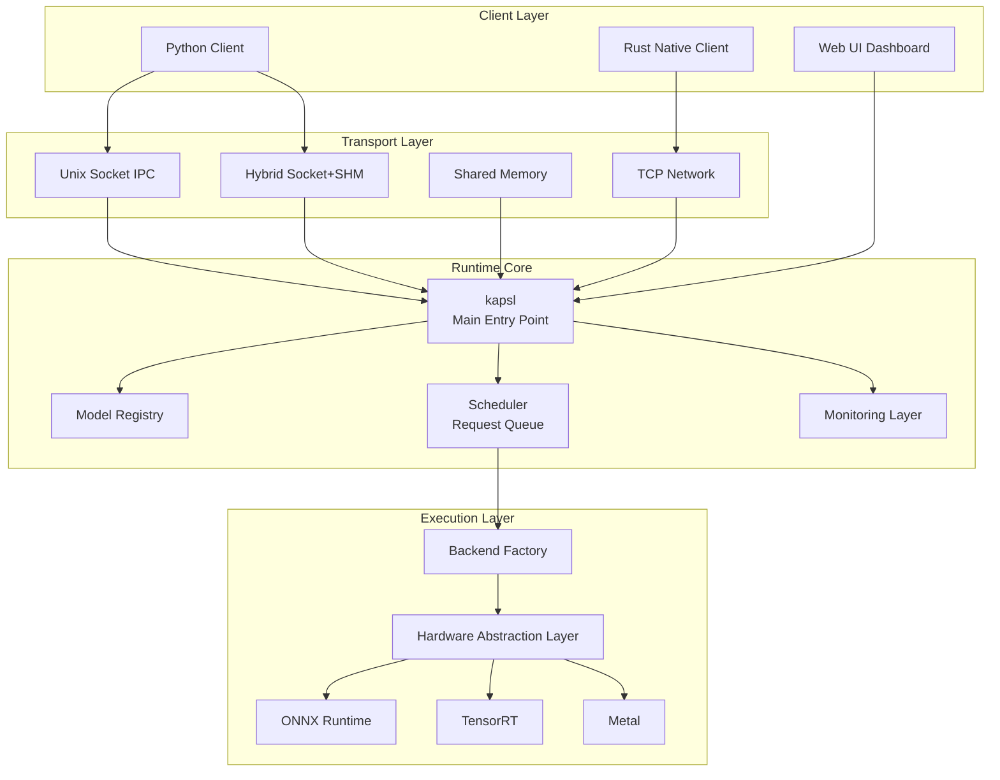

# kapsl-runtime Developer Guide

> **Last Updated**: March 5, 2026  
> **Version**: 0.1.0

A comprehensive guide for developers working with the kapsl-runtime ML inference platform.

---

## Table of Contents

1. [Architecture Overview](#architecture-overview)
2. [Prerequisites](#prerequisites)
3. [Installation & Build](#installation--build)
4. [Running the Runtime](#running-the-runtime)
5. [Client Integration](#client-integration)
6. [Model Management](#model-management)
7. [Monitoring & Metrics](#monitoring--metrics)
8. [Testing & Benchmarking](#testing--benchmarking)
9. [Troubleshooting](#troubleshooting)
10. [API Reference](#api-reference)

---

## Architecture Overview

### System Components



### Key Crates

| Crate | Purpose |
|-------|---------|
| [`kapsl`](file:///Users/kiennguyen/Documents/Code/idx/framework/kapsl-runtime/crates/kapsl-cli) | Main binary, server orchestration, HTTP API |
| [`kapsl-backends`](file:///Users/kiennguyen/Documents/Code/idx/framework/kapsl-runtime/crates/kapsl-backends) | ML backend implementations (ONNX, TensorRT, etc.) |
| [`kapsl-hal`](file:///Users/kiennguyen/Documents/Code/idx/framework/kapsl-runtime/crates/kapsl-hal) | Hardware detection and device management |
| [`kapsl-scheduler`](file:///Users/kiennguyen/Documents/Code/idx/framework/kapsl-runtime/crates/kapsl-scheduler) | Request prioritization, batching, sticky routing |
| [`kapsl-transport`](file:///Users/kiennguyen/Documents/Code/idx/framework/kapsl-runtime/crates/kapsl-transport) | Transport abstraction layer |
| [`kapsl-ipc`](file:///Users/kiennguyen/Documents/Code/idx/framework/kapsl-runtime/crates/kapsl-ipc) | Unix socket & TCP server implementations |
| [`kapsl-shm`](file:///Users/kiennguyen/Documents/Code/idx/framework/kapsl-runtime/crates/kapsl-shm) | Shared memory zero-copy transport |
| [`kapsl-pyo3`](file:///Users/kiennguyen/Documents/Code/idx/framework/kapsl-runtime/crates/kapsl-pyo3) | Python bindings (exported as `kapsl_runtime` module) |
| [`kapsl-monitor`](file:///Users/kiennguyen/Documents/Code/idx/framework/kapsl-runtime/crates/kapsl-monitor) | Prometheus metrics & instrumentation |
| [`kapsl-core`](file:///Users/kiennguyen/Documents/Code/idx/framework/kapsl-runtime/crates/kapsl-core) | Core types, model registry, package loader |

---

## Prerequisites

### Required

- **Rust**: 1.75 or higher

  ```bash
  curl --proto '=https' --tlsv1.2 -sSf https://sh.rustup.rs | sh
  ```

- **Python**: 3.8+ (for Python client)

  ```bash
  python3 --version
  ```

### Optional (for GPU acceleration)

- **NVIDIA CUDA Toolkit**: 11.x or 12.x (for CUDA backend)
- **TensorRT**: 8.x+ (for TensorRT optimization)
- **DirectML**: Windows only (via onnxruntime-directml)

### Platform Support

| Platform | Socket | TCP | SHM | Hybrid | GPU |
|----------|--------|-----|-----|--------|-----|
| Linux | ✅ | ✅ | ✅ | ✅ | CUDA/TensorRT |
| macOS | ✅ | ✅ | ✅ | ✅ | Metal |
| Windows | ✅ Named Pipes | ✅ | ✅ | ✅ | DirectML |

---

## Installation & Build

### 1. Clone & Navigate

```bash
cd /Users/kiennguyen/Documents/Code/idx/framework/kapsl-runtime
```

### 2. Build the Runtime

**Release build** (recommended for production):

```bash
cargo build --release
```

**Debug build** (faster compilation, slower execution):

```bash
cargo build
```

Built binaries will be in:

- `target/release/kapsl` (release)
- `target/debug/kapsl` (debug)

### 3. Build Python Client (Optional)

```bash
cd crates/kapsl-pyo3

# Create virtual environment
python3 -m venv .venv
source .venv/bin/activate  # On Windows: .venv\Scripts\activate

# Install maturin (PyO3 build tool)
pip install maturin

# Build and install Python module
maturin develop --release
```

This creates the `kapsl_runtime` Python module with these classes:

- `KapslClient` - Unix socket client
- `KapslShmClient` - Shared memory client
- `KapslHybridClient` - Hybrid socket+SHM client

---

## Running the Runtime

### Quick Start (Default Configuration)

#### Step 1: Create a Model Package

Generate a sample MNIST model package:

```bash
chmod +x scripts/packages/mnist/create_package.sh
./scripts/packages/mnist/create_package.sh
```

This creates [models/mnist/mnist.aimod](file:///Users/kiennguyen/Documents/Code/idx/framework/kapsl-runtime/models/mnist/mnist.aimod).

#### Step 2: Start the Runtime

```bash
cargo run -p kapsl -- --model models/mnist/mnist.aimod
```

**Expected output**:

```
🚀 Starting kapsl-runtime...

=== Hardware Detection ===
CPU: 8 cores
Memory: 16384 MB
OS: macos (14.0)
CUDA: ✗ Not available
Metal: ✓ Available
Best provider: cpu

=== Package Loading ===
✓ Package loaded
  Project: mnist-demo
  Framework: onnx
  Version: 1.0.0
✓ Model loaded successfully
✓ Scheduler started for Model ID 0

=== Starting Transport Server ===
Transport mode: socket
Socket: /tmp/kapsl.sock
✓ Server ready

🎉 kapsl-runtime is running!
════════════════════════════════════════

🌐 Web UI available at http://localhost:9095/
📊 Metrics available at http://localhost:9095/metrics
🔌 API available at http://localhost:9095/api/
```

---

### Transport Modes

The runtime supports multiple transport mechanisms. Choose based on your performance and deployment needs.

#### 1. Unix Socket (Default)

**Best for**: Local development, single-machine deployments

```bash
cargo run -p kapsl -- \
  --model models/mnist/mnist.aimod \
  --transport socket \
  --socket /tmp/kapsl.sock
```

**Pros**: Simple, low latency  
**Cons**: Local only, not cross-platform

---

#### 2. TCP Network

**Best for**: Distributed systems, containerized environments, remote access

```bash
cargo run -p kapsl -- \
  --model models/mnist/mnist.aimod \
  --transport tcp \
  --bind 0.0.0.0 \
  --port 9096
```

**Pros**: Network-accessible, cross-platform  
**Cons**: Higher latency than IPC, requires network security

---

#### 3. Shared Memory (SHM)

**Best for**: Maximum throughput, large tensors, low-latency requirements

```bash
cargo run -p kapsl -- \
  --model models/mnist/mnist.aimod \
  --transport shm
```

> **Note**: Shared memory name is auto-generated as `/kapsl_shm_<PID>` (watch startup logs for exact name)

**Pros**: Zero-copy, ultra-low latency  
**Cons**: Limited to local machine

---

#### 4. Hybrid (Socket + SHM)

**Best for**: Production workloads with large inputs

Combines socket for control plane and shared memory for data plane.

```bash
cargo run -p kapsl -- \
  --model models/mnist/mnist.aimod \
  --transport hybrid \
  --socket /tmp/kapsl.sock
```

**How it works**:

1. Client registers SHM region via socket
2. Large tensors transferred via zero-copy SHM
3. Responses sent back through socket

---

### Advanced Configuration

#### Loading Multiple Models

```bash
cargo run -p kapsl -- \
  --model models/mnist/mnist.aimod \
  --model squeezenet.aimod \
  --model heavy.aimod \
  --batch-size 4 \
  --metrics-port 9095
```

Models are assigned IDs sequentially (0, 1, 2, ...).

#### Custom Metrics Port

```bash
cargo run -p kapsl -- \
  --model models/mnist/mnist.aimod \
  --metrics-port 8080
```

#### GPU-Specific Models

Create a metadata file with CUDA preference:

```json
{
  "project_name": "mnist-cuda",
  "framework": "onnx",
  "version": "1.0.0",
  "created_at": "2025-12-04T10:00:00Z",
  "model_file": "mnist.onnx",
  "hardware_requirements": {
    "preferred_provider": "cuda",
    "fallback_providers": ["cpu"],
    "graph_optimization_level": "all"
  }
}
```

Package and run:

```bash
tar -czf mnist-cuda.aimod metadata_cuda.json mnist.onnx
cargo run -p kapsl -- --model mnist-cuda.aimod
```

---

## Client Integration

### Python Client

#### Installation

```bash
# Build and install the Python module
cd crates/kapsl-pyo3
maturin develop --release

# Or use pip install if wheel is built
pip install kapsl-runtime
```

#### Example 1: Socket Client

```python
#!/usr/bin/env python3
import numpy as np
from kapsl_runtime import KapslClient

# Connect to runtime
client = KapslClient("/tmp/kapsl.sock")

# Prepare input (MNIST: 1x1x28x28)
input_data = np.random.randn(1, 1, 28, 28).astype(np.float32)
input_shape = [1, 1, 28, 28]
input_bytes = input_data.tobytes()

# Run inference
result_bytes = client.infer(
    model_id=0,
    input_shape=input_shape,
    dtype="float32",
    data=input_bytes
)

# Parse result
result = np.frombuffer(result_bytes, dtype=np.float32)
print(f"Result shape: {result.shape}")
print(f"Prediction: {np.argmax(result)}")
```

#### Example 2: Hybrid Client (Socket + SHM)

```python
#!/usr/bin/env python3
import numpy as np
from kapsl_runtime import KapslHybridClient

# Connect with SHM name from server logs (e.g., /kapsl_shm_12345)
client = KapslHybridClient("/kapsl_shm_12345", "/tmp/kapsl.sock")

# Prepare large input (SqueezeNet: 1x3x224x224)
input_data = np.random.randn(1, 3, 224, 224).astype(np.float32)
input_shape = [1, 3, 224, 224]
input_bytes = input_data.tobytes()

# Run inference (automatically uses SHM for large tensors)
result_bytes = client.infer(
    input_shape=input_shape,
    dtype="float32",
    data=input_bytes
)

result = np.frombuffer(result_bytes, dtype=np.float32)
print(f"Result: {result.shape}")
```

See [test_hybrid_simple.py](file:///Users/kiennguyen/Documents/Code/idx/framework/kapsl-runtime/scripts/test_hybrid_simple.py) for complete example.

#### Example 3: Concurrent Requests

```python
import concurrent.futures
from kapsl_runtime import KapslClient

def run_inference(client, request_id):
    input_data = np.random.randn(1, 1, 28, 28).astype(np.float32)
    result = client.infer(0, [1, 1, 28, 28], "float32", input_data.tobytes())
    return request_id, result

client = KapslClient("/tmp/kapsl.sock")

with concurrent.futures.ThreadPoolExecutor(max_workers=10) as executor:
    futures = [executor.submit(run_inference, client, i) for i in range(100)]
    results = [f.result() for f in concurrent.futures.as_completed(futures)]

print(f"Completed {len(results)} inferences")
```

---

### Native Rust Client

#### TCP Client Example

```rust
use kapsl_transport::{TensorData, TensorMetadata};
use tokio::net::TcpStream;
use tokio::io::{AsyncReadExt, AsyncWriteExt};

#[tokio::main]
async fn main() -> Result<(), Box<dyn std::error::Error>> {
    let mut stream = TcpStream::connect("127.0.0.1:9096").await?;
    
    // Prepare tensor
    let input = vec![0.5f32; 28 * 28];
    let metadata = TensorMetadata {
        shape: vec![1, 1, 28, 28],
        dtype: "float32".to_string(),
    };
    
    // Serialize request
    let request = bincode::serialize(&(0u32, metadata, input))?;
    
    // Send request
    stream.write_u32(request.len() as u32).await?;
    stream.write_all(&request).await?;
    
    // Read response
    let response_len = stream.read_u32().await?;
    let mut buffer = vec![0u8; response_len as usize];
    stream.read_exact(&mut buffer).await?;
    
    let result: Vec<f32> = bincode::deserialize(&buffer)?;
    println!("Result: {:?}", result);
    
    Ok(())
}
```

See [native-hybrid-client](file:///Users/kiennguyen/Documents/Code/idx/framework/kapsl-runtime/scripts/native-hybrid-client) for production examples.

---

## Model Management

### Package Format

`.aimod` packages are `tar.gz` archives containing:

```
mnist.aimod
├── metadata.json       # Manifest
└── model.onnx         # Model file (or .trt, .mlmodel, etc.)
```

### Creating Packages

#### Manual Creation

```bash
# 1. Create metadata.json
cat > metadata.json << EOF
{
  "project_name": "my-model",
  "framework": "onnx",
  "version": "1.0.0",
  "created_at": "$(date -u +%Y-%m-%dT%H:%M:%SZ)",
  "model_file": "model.onnx",
  "hardware_requirements": {
    "preferred_provider": "cpu",
    "fallback_providers": ["cuda"],
    "graph_optimization_level": "basic"
  }
}
EOF

# 2. Package
tar -czf my-model.aimod metadata.json model.onnx
```

#### Using Helper Scripts

```bash
# See existing examples
./create_backend_packages.sh    # Create CUDA/CPU variants
./create_opt_test_packages.sh   # Test optimization levels
```

#### Model Cache and Disk Checks

When a model is loaded, `kapsl-core` copies the model file into a content-addressed cache directory (default: `.kapsl-model-cache/` next to the `.aimod` file) so that the temp-dir unpack can be cleaned up without losing the weights. Before copying, the loader:

1. Estimates how many bytes need to be written (skipping files already cached).
2. Checks that `available_disk >= reserved_free + required_bytes` and `cache_size + required_bytes <= max_cache`.
3. If either constraint is violated it evicts **least-recently-used** cache entries until space is available or raises `LoaderError::InsufficientDiskSpace`.

Relevant environment variables:

| Variable | Description |
| --- | --- |
| `KAPSL_MODEL_CACHE_DIR` | Cache root path (default: `.kapsl-model-cache/` beside the `.aimod`). |
| `KAPSL_MODEL_CACHE_MAX_BYTES` / `KAPSL_MODEL_CACHE_MAX_MIB` | Hard cap on total cache size (LRU eviction enforced). |
| `KAPSL_MODEL_CACHE_RESERVED_FREE_BYTES` / `KAPSL_MODEL_CACHE_RESERVED_FREE_MIB` | Minimum free disk space to leave after a copy. |
| `KAPSL_PACKAGE_TMP_DIR` | Custom temp dir for unpacking `.aimod` archives. |

### Runtime Model Loading/Stopping

#### Load New Model (via API)

```bash
curl -X POST http://localhost:9095/api/models/start \
  -H "Content-Type: application/json" \
  -d '{
    "model_id": 99,
    "model_path": "/path/to/model.aimod"
  }'
```

**Response**:

```json
{
  "message": "Model started successfully",
  "model_id": 99
}
```

#### Stop Running Model

```bash
curl -X POST http://localhost:9095/api/models/99/stop
```

**Response**:

```json
{
  "message": "Model 99 stopped successfully"
}
```

---

## Monitoring & Metrics

### Web Dashboard

Open [http://localhost:9095/](http://localhost:9095/) for a real-time UI showing:

- All running models
- Inference counts (successful/failed)
- Queue depth
- Health status
- Start/stop controls

Built with vanilla HTML/CSS/JS (no framework dependencies).

---

### REST API

#### List All Models

```bash
curl http://localhost:9095/api/models
```

**Response**:

```json
[
  {
    "id": 0,
    "name": "mnist-demo",
    "version": "1.0.0",
    "framework": "onnx",
    "device": "cpu",
    "optimization_level": "basic",
    "path": "/path/to/mnist.onnx",
    "status": "Active",
    "active_inferences": 2,
    "total_inferences": 1543,
    "queue_depth": [3, 10],
    "healthy": true
  }
]
```

#### Get Model Details

```bash
curl http://localhost:9095/api/models/0
```

**Response**:

```json
{
  "id": 0,
  "name": "mnist-demo",
  "version": "1.0.0",
  "framework": "onnx",
  "device": "cpu",
  "optimization_level": "basic",
  "path": "/path/to/mnist.onnx",
  "status": "Active",
  "active_inferences": 0,
  "total_inferences": 1543,
  "successful_inferences": 1541,
  "failed_inferences": 2,
  "queue_depth": [0, 10],
  "healthy": true
}
```

#### Health Check

```bash
curl http://localhost:9095/api/health
```

**Response**:

```json
{
  "status": "healthy",
  "total_models": 3,
  "healthy_models": 3,
  "unhealthy_models": 0
}
```

---

### Prometheus Metrics

View raw metrics:

```bash
curl http://localhost:9095/metrics
```

**Key metrics**:

- `kapsl_inference_count{model_id, status}` - Total inferences (counter)
- `kapsl_active_inferences{model_id}` - Concurrent requests (gauge)
- `kapsl_inference_duration_seconds{model_id}` - Latency histogram
- `kapsl_queue_depth{model_id}` - Current queue size (gauge)

### Scheduler Queue Overflow Policy

Each GPU worker has a dedicated `WorkQueue` with capacity set by `--scheduler-queue-size`. When the queue is at capacity the runtime applies the configured **overflow policy**:

| Policy | Behaviour |
| --- | --- |
| `block` *(default)* | Caller blocks until a slot becomes free. |
| `drop_newest` | The incoming request is immediately rejected with an overload error. |
| `drop_oldest` | The oldest waiting request is dropped (receives an overload error) and the new request is enqueued. |

High-priority (latency-critical) requests are routed to a dedicated high-priority queue and dispatched immediately; throughput-class requests enter the low-priority queue and can be micro-batched up to `--scheduler-max-micro-batch` size within `--scheduler-queue-delay-ms`.

The policy is set programmatically via `Scheduler::with_queue_overflow_policy`; a CLI flag is planned for a future release.

**Grafana setup**:

1. Add Prometheus data source pointing to `http://localhost:9095/metrics`
2. Import dashboard with queries like:

   ```promql
   rate(kapsl_inference_count[5m])
   histogram_quantile(0.95, kapsl_inference_duration_seconds_bucket)
   ```

---

## Testing & Benchmarking

### Unit Tests

```bash
# Test all crates
cargo test --workspace

# Test specific crate
cargo test -p kapsl-scheduler
```

### Integration Tests

#### Test Socket Connection

```bash
# Terminal 1: Start server
cargo run -p kapsl -- --model models/mnist/mnist.aimod

# Terminal 2: Run test
python scripts/test_socket_simple.py
```

Expected output:

```
Sending header (12 bytes): 00000000010000000a000000
Sending payload (10 bytes): 30313233343536373839
Reading response header (8 bytes)...
Received (8 bytes): 0000000004000000
Status: 0, Payload size: 4
✓ Success!
```

#### Test Hybrid Transport

```bash
# Terminal 1: Start hybrid server
cargo run -p kapsl -- --model squeezenet.aimod --transport hybrid

# Note the SHM name from logs (e.g., /kapsl_shm_12345)

# Terminal 2: Run test
python scripts/test_hybrid_simple.py /kapsl_shm_12345
```

---

### Benchmarking

#### Quick Benchmark

```bash
python scripts/quick_bench.py
```

Runs 1000 inferences and reports:

- Total time
- Requests/sec
- Mean latency
- P95/P99 latency

---

#### Production Benchmark Suite

```bash
chmod +x scripts/benchmark_production.sh
./scripts/benchmark_production.sh
```

Tests multiple scenarios:

- Single-threaded baseline
- 10 concurrent clients
- 50 concurrent clients
- Different batch sizes
- Different transport modes

Results saved to `benchmark_results_<timestamp>.txt`.

---

#### Compare Transport Modes

```bash
python scripts/benchmark_comparison.py
```

Compares:

- Socket IPC
- TCP Network
- Shared Memory
- Hybrid

Outputs a table:

```
| Mode   | Throughput (req/s) | Latency P50 (ms) | Latency P99 (ms) |
|--------|-------------------|------------------|------------------|
| Socket | 1234              | 2.3              | 5.8              |
| SHM    | 3456              | 0.8              | 2.1              |
| Hybrid | 3201              | 1.0              | 2.5              |
```

---

## Troubleshooting

### Common Issues

#### 1. Socket Already in Use

**Error**:

```
Error: Address already in use (os error 48)
```

**Solution**:

```bash
# Remove stale socket file
rm /tmp/kapsl.sock

# Or use a different path
cargo run -p kapsl -- --model models/mnist/mnist.aimod --socket /tmp/kapsl2.sock
```

---

#### 2. CUDA Not Detected

**Error**:

```
CUDA: ✗ Not available
```

**Solutions**:

1. Verify CUDA installation:

   ```bash
   nvidia-smi
   nvcc --version
   ```

2. Check environment variables:

   ```bash
   echo $CUDA_HOME
   echo $LD_LIBRARY_PATH
   ```

3. Rebuild with CUDA support:

   ```bash
   cargo clean
   cargo build --release
   ```

---

#### 3. Model Load Failure

**Error**:

```
Failed to load model 0: ONNX error
```

**Debug steps**:

1. Check model file integrity:

   ```bash
   tar -tzf model.aimod
   ```

2. Validate metadata JSON:

   ```bash
   tar -xzOf model.aimod metadata.json | python -m json.tool
   ```

3. Enable debug logging:

   ```bash
   RUST_LOG=debug cargo run -p kapsl -- --model model.aimod
   ```

---

#### 6. InsufficientDiskSpace on Model Load

**Error**:

```
LoaderError::InsufficientDiskSpace: insufficient disk space for model cache at …
```

**Solutions**:

1. Point the cache at a larger volume:

   ```bash
   export KAPSL_MODEL_CACHE_DIR=/mnt/ssd/kapsl-cache
   ```

2. Raise (or remove) the cache size cap:

   ```bash
   export KAPSL_MODEL_CACHE_MAX_MIB=20480   # 20 GiB
   ```

3. Manually prune old entries from `.kapsl-model-cache/` next to your model file.

---

#### 7. kapsl vs vLLM Qwen Benchmark

A one-command benchmark comparison lives at `engine/kapsl-benchmarks/run_kapsl_vs_vllm_qwen.sh`. It starts a tuned kapsl instance, verifies that vLLM is ready, then sweeps throughput and latency against both. See `engine/kapsl-benchmarks/README.md` for options.

#### 4. Python Module Not Found

**Error**:

```python
ModuleNotFoundError: No module named 'kapsl_runtime'
```

**Solution**:

```bash
cd crates/kapsl-pyo3
source .venv/bin/activate
maturin develop --release

# Verify installation
python -c "import kapsl_runtime; print(dir(kapsl_runtime))"
```

---

#### 5. High Latency / Slow Inference

**Investigation**:

1. Check queue depth:

   ```bash
   curl http://localhost:9095/api/models/0 | jq .queue_depth
   ```

2. Monitor metrics:

   ```bash
   curl http://localhost:9095/metrics | grep inference_duration
   ```

3. Increase batch size:

   ```bash
   cargo run -p kapsl -- --model model.aimod --batch-size 8
   ```

4. Enable graph optimizations in metadata.json:

   ```json
   {
     "hardware_requirements": {
       "graph_optimization_level": "all"
     }
   }
   ```

5. Use GPU if available:

   ```json
   {
     "hardware_requirements": {
       "preferred_provider": "cuda"
     }
   }
   ```

---

## API Reference

### Command-Line Arguments

```
kapsl [OPTIONS] --model <PATH>...

OPTIONS:
  -m, --model <PATH>...           Path(s) to .aimod package(s) [required]
      --transport <MODE>          Transport: socket, tcp, shm, hybrid, auto [default: socket]
  -s, --socket <PATH>             Unix socket path [default: /tmp/kapsl.sock]
      --bind <ADDR>               TCP bind address [default: 0.0.0.0]
      --port <PORT>               TCP port [default: 9096]
      --batch-size <SIZE>         Max batch size [default: 1]
      --metrics-port <PORT>       Metrics/API HTTP port [default: 9095]
  -h, --help                      Print help
  -V, --version                   Print version
```

---

### Python API

#### `KapslClient(socket_path: str, max_pool_size: int = 8)`

Unix socket client for local inference.

**Methods**:

- `infer(model_id: int, input_shape: List[int], dtype: str, data: bytes) -> bytes`

**Example**:

```python
client = KapslClient("/tmp/kapsl.sock")
result = client.infer(0, [1, 1, 28, 28], "float32", input_bytes)
```

---

#### `KapslShmClient(shm_name: str)`

Shared memory client for high-throughput inference.

**Methods**:

- `infer(input_shape: List[int], dtype: str, data: bytes) -> bytes`

**Example**:

```python
client = KapslShmClient("/kapsl_shm_12345")
result = client.infer([1, 3, 224, 224], "float32", input_bytes)
```

---

#### `KapslHybridClient(shm_name: str, socket_path: str)`

Hybrid client using SHM for data plane and socket for control plane.

**Methods**:

- `infer(input_shape: List[int], dtype: str, data: bytes) -> bytes`

**Example**:

```python
client = KapslHybridClient("/kapsl_shm_12345", "/tmp/kapsl.sock")
result = client.infer([1, 3, 224, 224], "float32", input_bytes)
```

---

### HTTP API Endpoints

| Method | Endpoint | Description |
|--------|----------|-------------|
| `GET` | `/api/models` | List all models |
| `GET` | `/api/models/:id` | Get model details |
| `POST` | `/api/models/start` | Start a new model |
| `POST` | `/api/models/:id/stop` | Stop a running model |
| `GET` | `/api/health` | System health check |
| `GET` | `/api/system/stats` | Runtime process stats (RSS/GPU util) |
| `GET` | `/metrics` | Prometheus metrics |
| `GET` | `/` | Web dashboard UI |

---

## Additional Resources

### Configuration Examples

- [metadata.json](file:///Users/kiennguyen/Documents/Code/idx/framework/kapsl-runtime/metadata.json) - Basic CPU config
- [metadata_cuda.json](file:///Users/kiennguyen/Documents/Code/idx/framework/kapsl-runtime/scripts/metadata_cuda.json) - CUDA config
- [metadata_opt_all.json](file:///Users/kiennguyen/Documents/Code/idx/framework/kapsl-runtime/scripts/metadata_opt_all.json) - Full optimizations

### Test Scripts

- [test_socket_simple.py](file:///Users/kiennguyen/Documents/Code/idx/framework/kapsl-runtime/scripts/test_socket_simple.py) - Basic socket test
- [test_hybrid_simple.py](file:///Users/kiennguyen/Documents/Code/idx/framework/kapsl-runtime/scripts/test_hybrid_simple.py) - Hybrid transport test
- [concurrent_simple.py](file:///Users/kiennguyen/Documents/Code/idx/framework/kapsl-runtime/scripts/concurrent_simple.py) - Concurrent load test

### Benchmark Scripts

- [quick_bench.py](file:///Users/kiennguyen/Documents/Code/idx/framework/kapsl-runtime/scripts/quick_bench.py) - Quick latency test
- [benchmark_comparison.py](file:///Users/kiennguyen/Documents/Code/idx/framework/kapsl-runtime/scripts/benchmark_comparison.py) - Transport mode comparison
- [benchmark_production.sh](file:///Users/kiennguyen/Documents/Code/idx/framework/kapsl-runtime/scripts/benchmark_production.sh) - Full benchmark suite

---

## Support & Contributing

### Logging

Enable detailed logging for debugging:

```bash
# Debug level
RUST_LOG=debug cargo run -p kapsl -- --model model.aimod

# Trace level (very verbose)
RUST_LOG=trace cargo run -p kapsl -- --model model.aimod

# Module-specific
RUST_LOG=kapsl_scheduler=debug cargo run -p kapsl -- --model model.aimod
```

Logs are written to:

- **Console**: stdout/stderr
- **File**: `kapsl.log` (if enabled)

---

### Performance Tuning

**For maximum throughput**:

1. Use `--transport shm` or `--transport hybrid`
2. Increase `--batch-size` (e.g., 4, 8, 16)
3. Set `graph_optimization_level: "all"` in metadata
4. Use GPU if available (`preferred_provider: "cuda"`)
5. Enable multi-GPU with multiple engine handles

**For minimum latency**:

1. Use `--batch-size 1`
2. Set `graph_optimization_level: "basic"`
3. Use `--transport socket` for simplicity
4. Deploy on dedicated hardware with CPU pinning

---

### Architecture Decisions

> **Why multiple transport modes?**  
> Different deployment scenarios have different requirements. Socket IPC is simple for local dev, TCP works in containers/k8s, SHM provides zero-copy for large models, and Hybrid balances flexibility with performance.

> **Why Rust?**  
> Memory safety, zero-cost abstractions, and excellent concurrency support make Rust ideal for high-performance inference serving.

> **Why PyO3 instead of REST for Python?**  
> Direct FFI calls eliminate HTTP overhead, serialization costs, and network latency for local workloads. REST API is still available for remote/web clients.

---

## Quick Reference Card

```bash
# Build
cargo build --release

# Run (basic)
cargo run -p kapsl -- --model models/mnist/mnist.aimod

# Run (production)
cargo run -p kapsl -- \
  --model model1.aimod \
  --model model2.aimod \
  --transport hybrid \
  --batch-size 4 \
  --metrics-port 9095

# Test Python client
python scripts/test_socket_simple.py

# Check model status
curl http://localhost:9095/api/models

# View metrics
curl http://localhost:9095/metrics

# Benchmark
python scripts/quick_bench.py

# Debug
RUST_LOG=debug cargo run -p kapsl -- --model model.aimod
```

---

**Document Version**: 1.0  
**Maintained by**: kapsl-runtime development team  
**Last Review**: December 4, 2025
